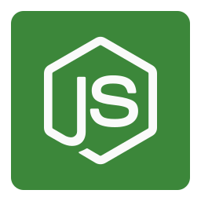

<div align="center">

## API Nodejs



API desenvolvida em node, para facilitar o desenvolvimento em projetos futuros.

</div>

## 🧪 Tecnologias

Esse projeto foi desenvolvido com as seguintes tecnologias:

- Node.js
- TypeScript
- Express
- Multer
- TypeORM
- MySQL

## 🚀 Como executar

Clone o projeto e acesse a pasta

```bash
➜ git clone https://github.com/xpedroleonardo/api-nodejs.git

➜ cd api-nodejs
```

Antes você deverá acessar o arquivo <b>src/database/database.sql</b>, nele comtém o comando para realizar a criação do banco de dados.

Após a criação do banco de dados você deverá acessar o arquivo <b>ormconfig.json</b>, e altere os campos relacionados ao banco de dados, conforme está configurado na sua máquina.

```json
{
  "type": "mysql", //Drive de Conexão
  "host": "localhost", //Host
  "port": 3306, //Porta de Conexão
  "username": "root", //Usuário do Banco de Dados
  "password": "", //Senha do Banco de Dados
  "database": "apinodejs" //Nome do Banco de Dados
}
```

Para iniciá-lo, siga os passos abaixo:

### Utilizando Yarn

```bash
# Instalar as dependências
➜ yarn

# Criar as tabelas do banco de dados.
➜ yarn typeorm migration:run

# Iniciar o projeto
➜ yarn server
```

### Utilizando NPM

```bash
# Instalar as dependências
➜ npm install

# Criar as tabelas do banco de dados.
➜ npm run typeorm migration:run

# Iniciar o projeto
➜ npm run server
```

A API estará disponível no endereço http://localhost:3333.

## 🎯️ Rotas

<details>
<summary>Vizualizar rotas da API</summary>

- <b>URL</b> = http://localhost:3333

1.  (GET) Acessando: "<b>URL/</b>", retornará a lista de usuários cadastrados no banco de dados.

    ```json
    // Resultado da Listagem (Array de Usuários)
    [
      {
        "id": 1,
        "name": "Pedro Leonardo",
        "email": "pedro@gmail.com",
        "age": 20,
        "username": "xpedroleonardo",
        "avatar": "profile.png"
      },
      {
        "id": 2,
        "name": "Leonardo",
        "email": "leo@gmail.com",
        "age": 20,
        "username": "xleonardo",
        "avatar": "profile.png"
      }
    ]
    ```

2.  (POST) Acessando: "<b>URL/create</b>", você poderá enviar os dados solicitados como nome, email, avatar, etc. Para criar um novo usuário no Banco de Dados.

    ```json
    // Informações para Criar usuário
    {
      "name": "Pedro Leonardo",
      "email": "pedro@gmail.com",
      "age": 20,
      "username": "xpedroleonardo",
      "avatar": "profile.png",
      "password": "1234"
    }
    ```

3.  (GET) Acessando: "<b>URL/details/:id</b>", você irá vizualizas as informações do usuário selecionado.

    - Obs: no campo "<b>:id</b>" da url, você deverá informar o ID do usuário cadastrado.

      ```json
      // Retorna um Usuário
      {
        "id": 1,
        "name": "Pedro Leonardo",
        "email": "pedro@gmail.com",
        "age": 20,
        "username": "xpedroleonardo",
        "avatar": "profile.png"
      }
      ```

4.  (PUT) Acessado: "<b>URL/update/:id</b>", você poderá enviar os dados solicitados como nome, email, avatar, etc. Para editar um usuário cadastrado no Banco de Dados.

    - Obs: no campo "<b>:id</b>" da url, você deverá informar o ID do usuário cadastrado.

      ```json
      // Atualizando alguns campos
      {
        "name": "Pedro",
        "email": "pedroleo@gmail.com",
        "age": 21,
        "username": "pedrodev",
        "avatar": "avatar.png",
        "password": "4321"
      }
      ```

5.  (POST) Acessado: "<b>URL/auth</b>", você poderá apagar um usuário cadastrado no Banco de Dados, mas para isso você deverá estar <b>autenticado</b> na API.

    ```json
    {
      "email": "pedroleo@gmail.com",
      "password": "4321"
    }
    ```

    Se os dados estiverem corretos, retornará o seu token de acesso:

    ```json
    {
      "token": "XXXXXXXXXXXXXX",
      "message": "User Authenticated!"
    }
    ```

6.  (DELETE) Acessado: "<b>URL/delete/:id</b>", você poderá apagar um usuário cadastrado no Banco de Dados, mas para isso você deverá estar <b>autenticado</b> na API.

    - Obs: no campo "<b>:id</b>" da url, você deverá informar o ID do usuário cadastrado.

      Quando realizar o acesso a essa rota, você deverá passar um <b>Header</b> para completar a requisição:

      | Header        | Token               |
      | :------------ | :------------------ |
      | authorization | Bearer <b>TOKEN</b> |

      <b>TOKEN</b> = Token gerado ao realizar a autenticação.

      Se o token for válido, o usuário será <b>deletado</b>:

      ```json
      {
        "message": "Successfully deleted!"
      }
      ```

</details>

As rotas foram testadas utilizando o [Insominia](https://insomnia.rest/download).

## 💻 Projeto

O projeto foi desenvolvido para ser utilizado como base, quando for desenvolver uma API para projetos futuros, para adiantar alguns passos, como CRUD, rotas, banco de dados, upload de arquivos entre outros.

## 📝 License

Esse projeto está sob a licença MIT. Veja o arquivo [LICENSE](LICENSE) para mais detalhes.

---

Feito com ❤ por [Pedro Leonardo](https://github.com/xpedroleonardo) | Gostou do projeto ? Dê uma estrela ⭐
